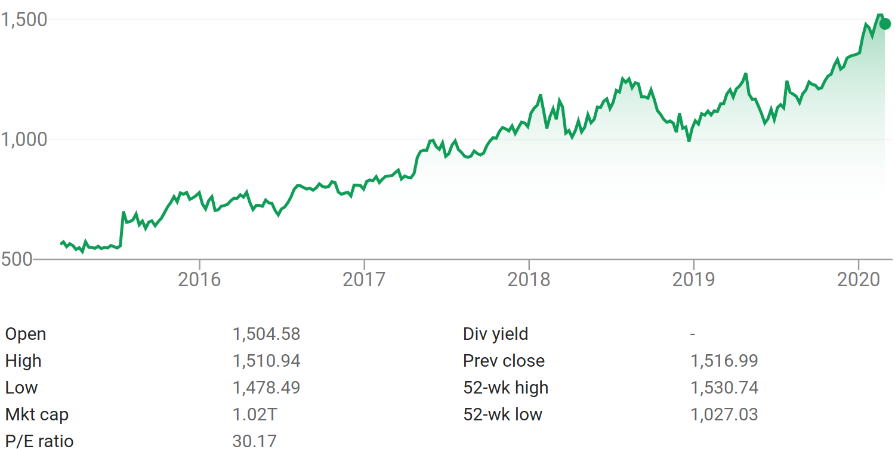

# stock-predictor

## Overview

A Client and Server that operate a website that allows users to predict stocks.

*CS361 Winter 2020 project*

API Documentation [here](docs/API.md).

## Starting the Server

Simply run `./start.sh` - this will check for requirements, then start the server. *Linux only*

## Credits

All work here, unless otherwise mentioned, is proprietary work of 

 - @lyellread
 - @detjensrobert
 - @dzobak
 - @emeraldbuttons
 - @remikendig 

Copying of any kind with the intention of submitting as a class assignment is not permitted - this will count as plaigarism.
